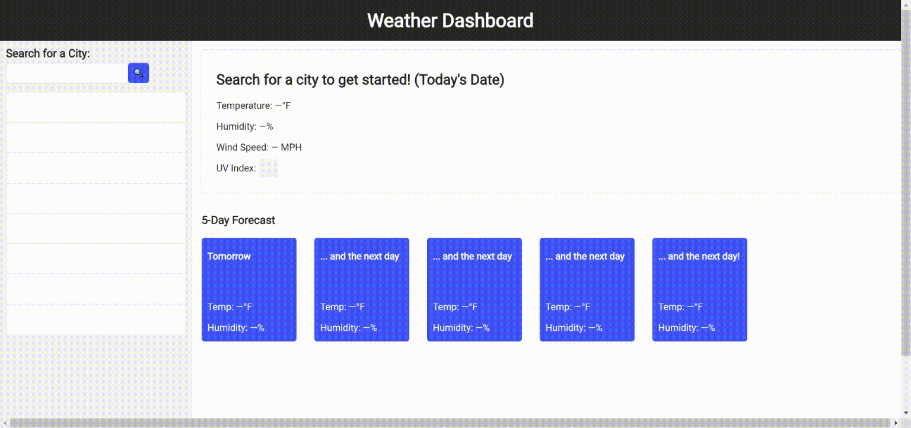

# 06 Server-Side APIs
# Weather Dashboard

This application allows users to search for a city and view current and future weather conditions in that city. Up to 8 previous searches are saved to localStorage.

The deployed application can be found [here](https://elisesamanthadaly.github.io/06-Server-Side-APIs/). The application's GitHub repository can be found [here](https://github.com/elisesamanthadaly/06-Server-Side-APIs/).

## Usage

Under "Search for a City," click into the search bar and type a city to search for its current and future weather conditions. The search can be submitted by hitting the "Enter" key on the keyboard or clicking the 🔍 button. The city search input can include any combination of lower- and uppercase letters. If a valid city is not found through the search, the user will be notified in the search bar.

Once a valid city has been searched for, its current and future weather conditions will be shown in the fields in the right column.

The user can view results for the past 8 searches by clicking the boxes in the left column.

## Credits

This application relies on [OpenWeather API](https://openweathermap.org/api/).

Thank you [Steve Hansell](https://stackoverflow.com/users/171490/steve-hansell/) for the capitalize(); solution.

## License

MIT License

Copyright (c) 2021 Elise Daly

Permission is hereby granted, free of charge, to any person obtaining a copy
of this software and associated documentation files (the "Software"), to deal
in the Software without restriction, including without limitation the rights
to use, copy, modify, merge, publish, distribute, sublicense, and/or sell
copies of the Software, and to permit persons to whom the Software is
furnished to do so, subject to the following conditions:

The above copyright notice and this permission notice shall be included in all
copies or substantial portions of the Software.

THE SOFTWARE IS PROVIDED "AS IS", WITHOUT WARRANTY OF ANY KIND, EXPRESS OR
IMPLIED, INCLUDING BUT NOT LIMITED TO THE WARRANTIES OF MERCHANTABILITY,
FITNESS FOR A PARTICULAR PURPOSE AND NONINFRINGEMENT. IN NO EVENT SHALL THE
AUTHORS OR COPYRIGHT HOLDERS BE LIABLE FOR ANY CLAIM, DAMAGES OR OTHER
LIABILITY, WHETHER IN AN ACTION OF CONTRACT, TORT OR OTHERWISE, ARISING FROM,
OUT OF OR IN CONNECTION WITH THE SOFTWARE OR THE USE OR OTHER DEALINGS IN THE
SOFTWARE.
